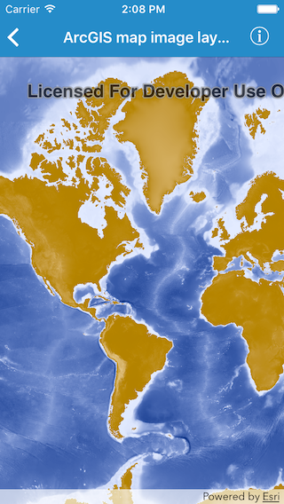

# ArcGIS map image layer (URL)

This sample demonstrates how to create a map image layer from a URL

## How it works

`AGSArcGISMapImageLayer` provides an initializer called `init(url:)` that takes a URL

