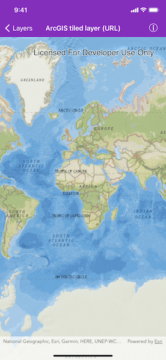

# ArcGIS tiled layer (URL)

Load a tiled layer from a map server with a URL.

## Use case

ArcGIS tiled layers are designed for fast and simple access by web maps, web apps, ArcGIS, and nearly any mapping software application. For example, you might want to use a basemap with tiles of streets to provide a visual reference for trees in a city. Tile layers are also useful for exposing a map or layer for the visualization of relatively static data.

## How to use the sample

Pan and zoom to explore the tiled layer basemap.

## How it works

1. Construct an `AGSArcGISTiledLayer` with an ArcGIS Online service URL.
2. Add the layer instance to the map's `operationalLayers` array.

## Relevant API

* AGSArcGISTiledLayer
* AGSMap

## Tags

tiles, basemap, tiled layer
