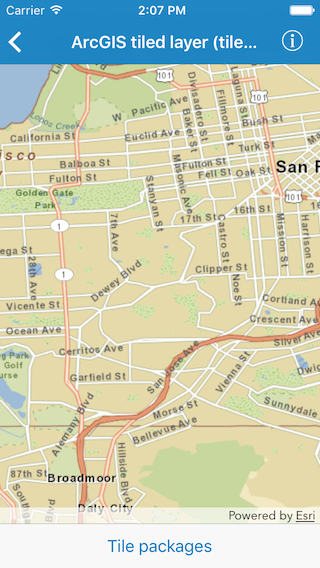

#ArcGIS tiled layer (tile cache)

This sample shows how to load an offline copy of a tiled map service so that that basemap tiled service is available when applications are offline

##How to use the sample

The sample opens with a local tiled layer already added as the basemap layer. You can tap on the `Tile packages` button in the bottom toolbar to get a list of tile packages available. The sample searches for tile packages in both the bundle and the document directory. So you can side load a tile package onto to the device using iTunes and open it inside the sample.

##How it works

The sample instantiates an `AGSTileCache` object using either name or path of the tile package. It then creates an `AGSArcGISTiledLayer` object using that tile cache and assign it as a basemap to the map. It repeats these steps when the user selects a new tile package.

