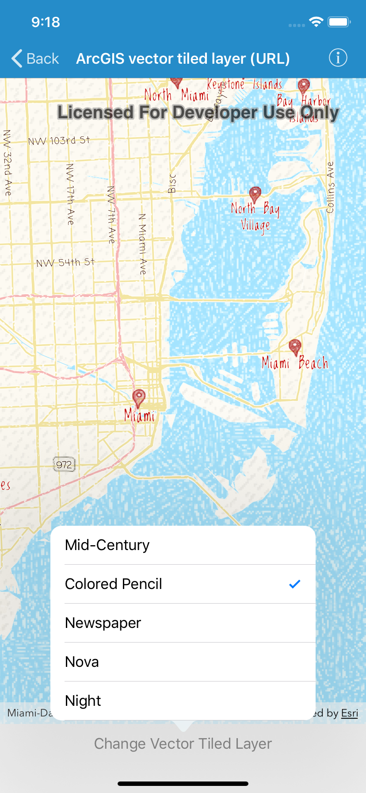

#ArcGIS vector tiled layer (URL)

This sample demonstrates how to create a vector tile layer from a URL

##How it works

`AGSArcGISVectorTiledLayer` provides an initializer called `initWithURL:` that takes a URL

