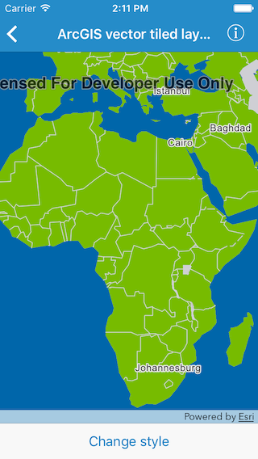
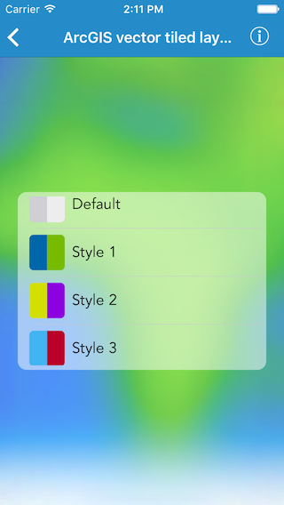

#ArcGIS vector tiled layer (custom style)

This sample demonstrates to use custom styled vector tiled layers

##How it works

`AGSArcGISVectorTiledLayer` provides an initializer called `init(url:)` that takes a URL

