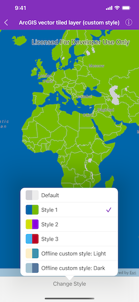
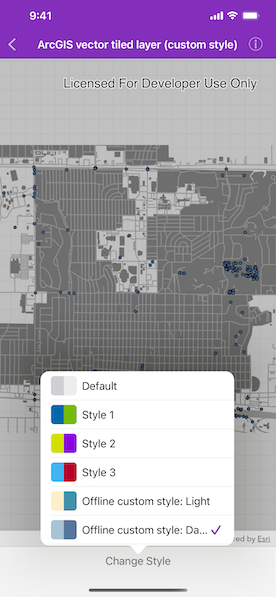

# ArcGIS vector tiled layer (custom style)

Load ArcGIS vector tiled layers using custom styles.

## Use case

Vector tile basemaps can be created in ArcGIS Pro and published as offline packages or online services. You can create a custom style tailored to your needs and easily apply them to your map. `AGSArcGISVectorTiledLayer` has many advantages over traditional raster based basemaps (`AGSArcGISTiledLayer`), including smooth scaling between different screen DPIs, smaller package sizes, and the ability to rotate symbols and labels dynamically.

## How to use the sample

Pan and zoom to explore the vector tile basemap.

## How it works

1. Construct an `AGSArcGISVectorTiledLayer` with the URL of a custom style.
2. Create an `AGSBasemap` from the `AGSArcGISVectorTiledLayer`.
3. Assign the `AGSBasemap` to the map's `basemap`.

## Relevant API

* AGSArcGISVectorTiledLayer
* AGSMap

## Tags

tiles, vector, vector basemap, vector tiled layer, vector tiles
