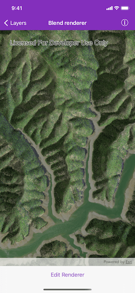
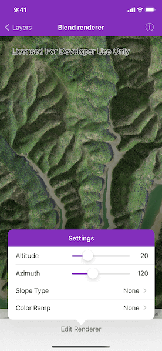
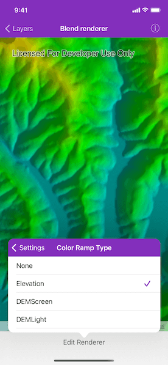

# Blend renderer

Blend a hillshade with a raster by specifying the elevation data. The resulting raster looks similar to the original raster, but with some terrain shading, giving it a textured look.

## How to use the sample

Tap the bottom button to choose and adjust the altitude, azimuth, slope type and color ramp type settings to update the image.

## How it works

1. Create an `AGSRaster` object from a raster file.
2. Create an `AGSRasterLayer` object from the raster.
3. Create an `AGSBasemap` object from the raster layer and set it to the map.
4. Create another `AGSRaster` object for elevation from a grayscale raster file.
5. Create an `AGSBlendRenderer` object, specifying the elevation raster, color ramp, and other properties.
    * If you specify a non-null color ramp, use the elevation raster as the base raster in addition to the elevation raster parameter. That way, the color ramp is used instead of the satellite imagery.
6. Set the blend renderer to the raster layer.

## Relevant API

* AGSBlendRenderer
* AGSColorRamp
* AGSRaster
* AGSRasterLayer

## Offline data

This sample uses the `Shasta.tif` and `Shasta_Elevation.tif` resources. They are downloaded from ArcGIS Online automatically.

## Tags

color ramp, elevation, hillshade, image, raster, raster layer, visualization
