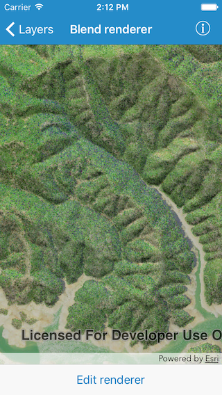
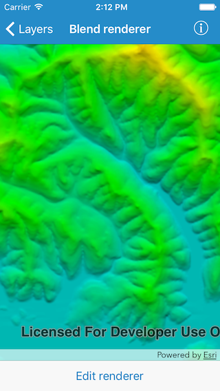
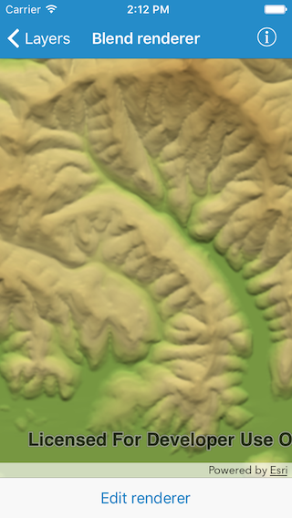

#Blend renderer

This sample demonstrates how to use blend renderer on a raster layer. You can get a hillshade blended with either a colored raster or color ramp.

##How to use the sample

Tap on the `Edit renderer` button in the toolbar to change the settings for the blend renderer. The sample allows you to change the Altitude, Azimuth, Slope type and Color ramp type. You can tap on the Render button to update the raster. If you use `None` as the color ramp type, colored raster is blended with the hillshade output. For all the other types a color ramp is used.

##How it works

The sample uses `AGSBlendRenderer` class to generate blend renderers. The settings provided by the user are put in the initializer to get a new renderer and the renderer is then set on the raster.

