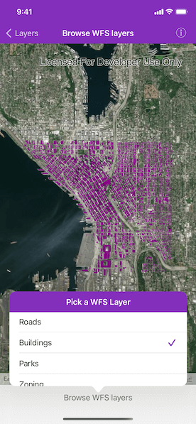

# Browse WFS layers

Browse a WFS service for layers and add them to the map.

## Use case

Services often have multiple layers available for display. For example, a feature service for a city might have layers representing roads, land masses, building footprints, parks, and facilities. A user can choose to only show the road network and parks for a park accessibility analysis.

## How to use the sample

Use the bottom button to select a layer from the list to display it on the map. 

Some WFS services return coordinates in X,Y order, while others return coordinates in lat/long (Y,X) order. If you don't see features rendered or you see features in the wrong location, use the swap switch to change the coordinate order and reload.

## How it works

1. Create an instance of `AGSWFSService` with a URL to a WFS feature service. 
2. Obtain a list of `AGSWFSLayerInfo` objects from `AGSWFSService.serviceInfo`
3. When a layer is selected, create an instance of `AGSWFSFeatureTable` from the `AGSWFSLayerInfo` object.  
    * Set the axis order if necessary.
4. Create a feature layer from the feature table. 
5. Add the feature layer to the map.  
    * The sample uses randomly-generated symbology, similar to the behavior in ArcGIS Pro.

## Relevant API

* AGSWGSService
* AGSWGSServiceInfo
* AGSWGSLayerInfo
* AGSWFSFeatureTable
* AGSFeatureLayer
* AGSWFSFeatureTable.axisOrder

## About the data

The sample is configured with a sample WFS service, but you can load other WFS services if desired. The default service shows [Seattle downtown features](https://arcgisruntime.maps.arcgis.com/home/item.html?id=1b81d35c5b0942678140efc29bc25391) hosted on ArcGIS Online.

## Tags

browse, catalog, feature, layers, OGC, service, web, WFS
