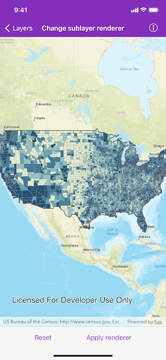

# Change sublayer renderer

Apply a renderer to a sublayer.

## Use case

A layer showing animal populations contains sublayers for different species. A renderer could be applied which gives each sublayer a different color, so that populations of each species can be compared visually.

## How to use the sample

Tap on "Apply renderer" button to apply a class breaks renderer based on population for each county. Tap on the "Reset" button to reset to original renderer.

## How it works

1. Create an `AGSArcGISMapImageLayer` from its URL.
2. After it is done loading, get the counties sublayer from the map image layer's `mapImageSublayers` array.
3. After the sublayer loads, get its original `AGSRenderer`.
4. Create an `AGSClassBreaksRenderer` with a collection of `AGSClassBreak`s for different population ranges.
5. Set the results as the sublayer's new `AGSRenderer`.

## Relevant API

* AGSArcGISMapImageLayer
* AGSArcGISMapImageSubLayer
* AGSClassBreaksRenderer
* AGSClassBreak

## About the data

This application displays census data from an ArcGIS Server map service. It contains various population statistics, including total population for each county in 2007.

## Additional information

The service hosting the layer must support dynamic layers to be able to change the rendering of sublayers.

## Tags

class breaks, dynamic layer, dynamic rendering, renderer, sublayer, symbology, visualization
