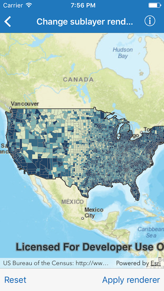

# Change sublayer renderer

This sample demonstrates how you to change renderer of a sublayer in map image layer

## How the app works

Tap on `Apply renderer` button to apply a class breaks renderer based on population for each county. Tap on the `Reset` button to reset to original renderer.

## How it works

The `mapImageSublayers` property on `AGSArcGISMapImageLayer` is used to get the Counties sublayer of type `AGSArcGISMapImageSublayer`. A new class breaks renderer is set on the sublayer via `renderer` property.

