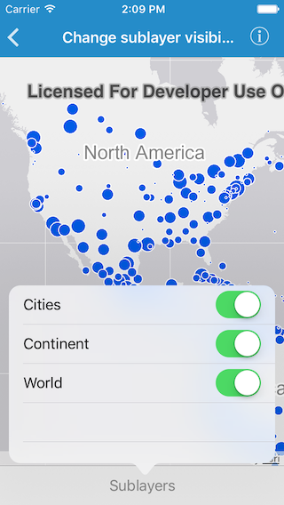
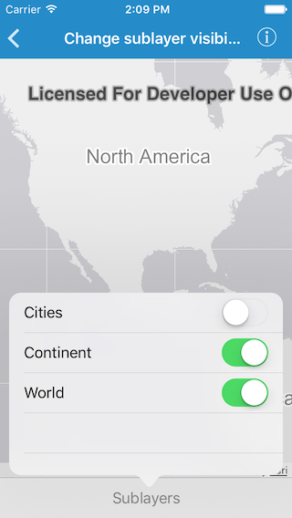

#Change sublayer visibility

This sample demonstrates how you can hide or show sublayers of a map image layer

##How the app works

Tapping on the `Sublayers` button in the bottom toolbar displays the list of sublayers. Each sublayer in the list has a switch, which can be used to toggle visibility of that particular sublayer.

##How it works

The `mapImageSublayers` property on `AGSArcGISMapImageLayer` is used to get the list of `AGSArcGISMapImageSublayer`. Each of these sublayer has a property called `visible`, which is used to toggle visibility.

