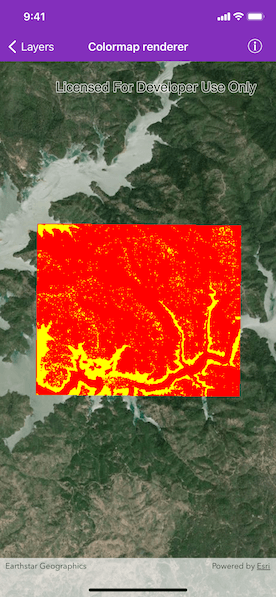

# Colormap Renderer

Apply a colormap renderer to a raster.

## Use Case

A colormap renderer transforms pixel values in a raster to display raster data based on specific colors, aiding in visual analysis of the data. For example, a forestry commission may want to quickly visualize areas above and below the tree-line occurring at a known elevation on a raster containing elevation values. They could overlay a transparent colormap set to color those areas below the tree-line elevation green, and those above white.

## How to use the sample

Pan and zoom to explore the effect of the colormap applied to the raster.

## How it works

1. Create a raster from a raster file.
2. Create a raster layer from the raster.
3. Create an array of 250 colors to represent the possible values from the raster. Colors at the beginning of the list replace the darkest values in the raster and colors at the end of the list replaced the brightest values of the raster.
4. Create a color map renderer with the color array and apply it to the raster layer.

## Relevant API

* AGSColormapRenderer
* AGSRaster
* AGSRasterLayer

## About the data

The raster used in this sample shows an area in the south of the Shasta-Trinity National Forest, California.

## Tags

data, colormap, raster, renderer, visualization
