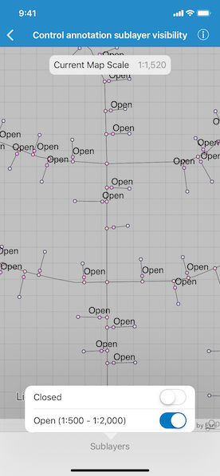

# Control annotation sublayer visibility

Use annotation sublayers to gain finer control of annotation layer subtypes.

## Use case

Annotation, which differs from labels by having a fixed place and size, is typically only relevant at particular scales. Annotation sublayers allow for finer control of annotation by allowing properties (like visibility in the map and legend) to be set and others to be read (like name) on subtypes of an annotation layer.

An annotation dataset which marks valves as "Opened" or "Closed", might be set to display the "Closed" valves over a broader range of scales than the "Opened" valves, if the "Closed" data is considered more relevant by the map's author. Regardless, the user can be given a manual option to set visibility of annotation sublayers on and off, if required.

## How to use the sample

Open the sample and take note of the visibility of the annotation. Zoom in and out to see the annotation turn on and off based on scale ranges set on the data.

Tap the Sublayers button and use the switches to manually set "Open" and "Closed" annotation sublayers visibility to on or off.

## How it works

1. Load the mobile map package.
2. Populate the table view with the annotation sublayer names (including maximum and minimum scales, where relevant).
3. Wire up the switches to toggle the annotation sublayer's visibility.
4. Observe changes to the map view's map scale to:
  * Update the current scale label toward the top of the screen.
  * Set the "Open" annotation sublayer row's text label to:
     * Enabled, when the layer is drawn at the current map scale.
     * Disabled, when the layer is not drawn at the current map scale.
 
## Relevant API

* AGSAnnotationLayer
* AGSAnnotationSublayer
* AGSLayerContent

## Offline Data

This sample uses the [Gas Device Anno](https://arcgisruntime.maps.arcgis.com/home/item.html?id=b87307dcfb26411eb2e92e1627cb615b) Mobile Map Package. It is downloaded from ArcGIS Online automatically.

## About the data

The scale ranges were set by the map's author using ArcGIS Pro:

* The "Open" annotation sublayer has its maximum scale set to 1:500 and its minimum scale set to 1:2000.
* The "Closed" annotation sublayer has no minimum or maximum scales set, so will be drawn at all scales.

## Tags

annotation, scale, text, utilities, visualization