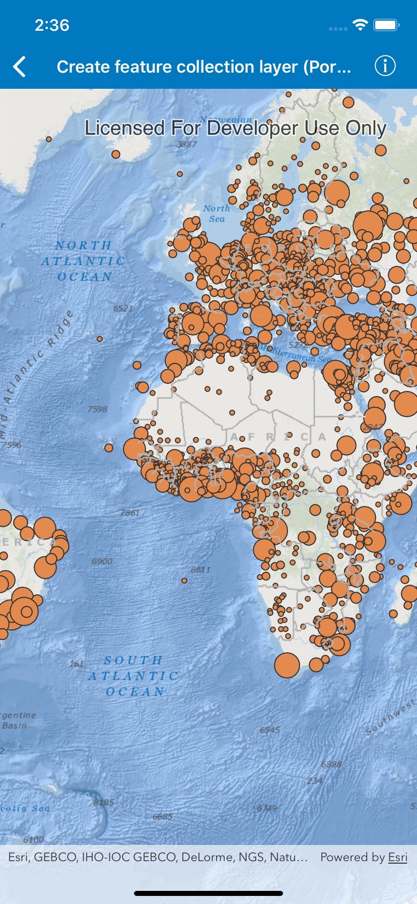

# Create feature collection layer (Portal item)

Create a feature collection layer from a portal item.

## Use case

Feature collection layers are often used to hold features with mixed geometry or unstructured data. You can display feature collections stored in a portal, which are often used for showing content from a CSV or map notes.

## How to use the sample

The feature collection is loaded from the portal item when the sample starts.

## How it works

1. Create an `AGSPortal`.
2. Create an `AGSPortalItem`, referring to the portal and an item ID.
3. Verify that the item represents a feature collection.
4. Create an `AGSFeatureCollection` from the item.
5. Create an `AGSFeatureCollectionLayer`, referring to the feature collection.
6. Add the feature collection layer to the map's `operationalLayers` peoperty.

## Relevant API

* AGSFeatureCollection
* AGSFeatureCollectionLayer
* AGSPortal
* AGSPortalItem

## About the data

The sample uses a sample layer depicting [world populations](https://www.arcgis.com/home/item.html?id=32798dfad17942858d5eef82ee802f0b).

## Tags

collection, feature collection, feature collection layer, id, item, map notes, portal
