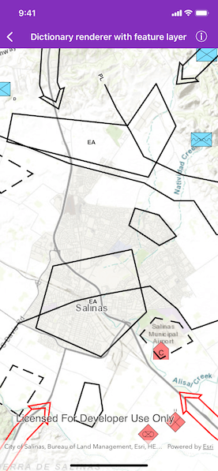

# Dictionary renderer with feature layer

Convert features into graphics to show them with mil2525d symbols.

## Use case

A dictionary renderer uses a style file along with a rule engine to display advanced symbology. This is useful for displaying features using precise military symbology.

## How to use the sample

This sample displays military symbology. Pan and zoom to explore the map.

## How it works

1. Create a geodatabase.
2. Instantiate and asynchronously load the symbol dictionary using the mil2525d.stylx file.
3. Load the geodatabase asynchronously.
4. Once the geodatabase is done loading, create a feature layer for each of the feature tables provided by the geodatabase.
5. Load the feature layers asynchronously.
6. After the last layer has loaded, set the viewpoint of the map to the full extent of all the layers.
7. Add the feature layer to map.
8. Render the symbol dictionary and add it to the layer.

## Relevant API

* AGSDictionaryRenderer
* AGSDictionarySymbolStyle
* AGSGeodatabase

## Tags

dictionaryrenderer, dictionarysymbolstyle, military, symbol
