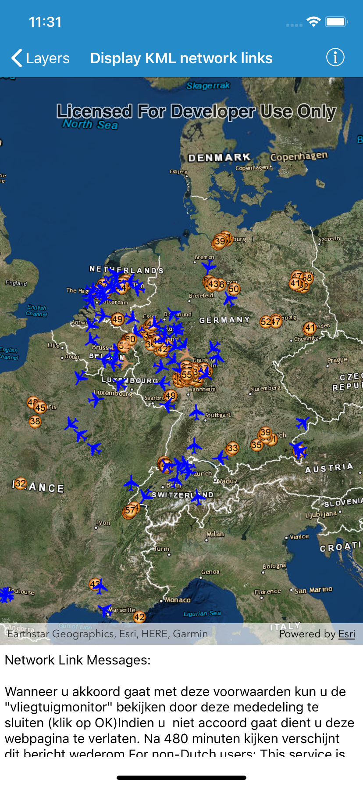

# Display KML network links

KML files can reference other KML files on the network and refresh content automatically. This sample demonstrates how to display a file with a network link as well as display any network link control messages.

## How to use the sample

The sample loads the KML file automatically and refreshes the data every few seconds.

## How it works

In general, no special code is needed to support showing KML/KMZ files with network links. KML supports specifying a message to show the user when loading a network link. Apps can optionally add a `networkLinkMessageHandler` on the `AGSKMLDataset` object to show any messages from KML network link controls.

## Relevant API

* `AGSKMLDataset`
* `AGSKMLLayer`

## About the data

This map shows the current air traffic in parts of Europe with heading, altitude, and ground speed. Additionally, noise levels from ground monitoring stations are shown.

## Tags

KML, KMZ, OGC, Keyhole, Network Link, Network Link Control