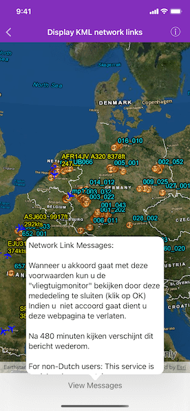

# Display KML network links

Display a file with a KML network link, including displaying any network link control messages at launch.

## Use case

KML files can reference other KML files on the network and support automatically refreshing content. For example, survey workers will benefit from KML data shown on their devices automatically refreshing to show the most up-to-date state. Additionally, discovering KML files linked to the data they are currently viewing provides additional information to make better decisions in the field.

## How to use the sample

The sample will load the KML file automatically. The data shown should refresh automatically every few seconds. Tap the bottom button to view messages. Pan and zoom to explore the map.

## How it works

1. Create an `AGSKMLDataset` from a KML source that has network links.
2. Construct an `AGSKMLLayer` with the dataset and add the layer to the map's `operationalLayers` array.
3. To listen for network messages, use the KML dataset's `networkLinkMessageHandler`.

## Relevant API

* AGSKMLDataset
* AGSKMLDataset.networkLinkMessageHandler
* AGSKMLLayer

## Offline data

This sample uses the radar.kmz file, which can be found on [ArcGIS Online](https://arcgisruntime.maps.arcgis.com/home/item.html?id=600748d4464442288f6db8a4ba27dc95).

## About the data

This map shows the current air traffic in parts of Europe with heading, altitude, and ground speed. Additionally, noise levels from ground monitoring stations are shown.

## Tags

Keyhole, KML, KMZ, Network Link, Network Link Control, OGC
