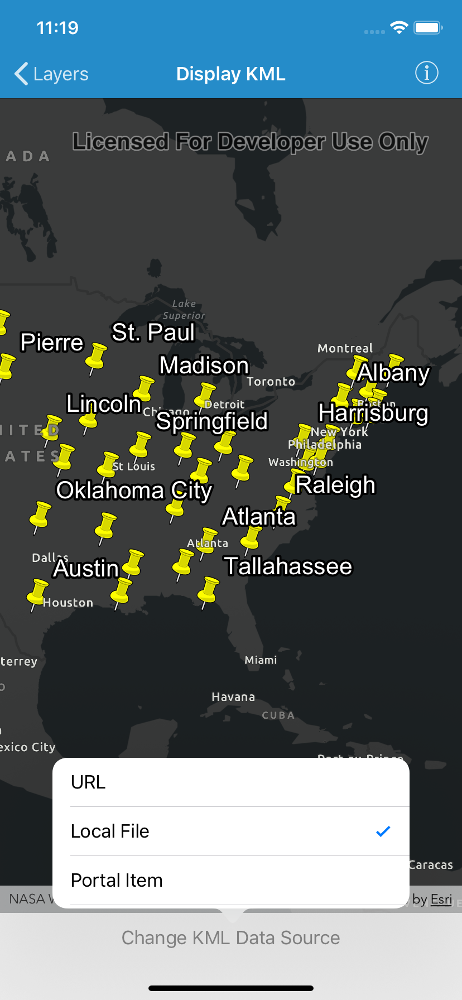

# Display KML

Load and display KML files from various sources, including URLs, local
files, and Portal items.

## How to use the sample

Tap the button to change the KML data source. The contents of the KML
source will be loaded and displayed in the map.

## About the data

The sample displays three different KML files, each from a different
source:

  - **URL**: a map of the significant weather outlook in the U.S.
    produced by NOAA/NWS. It uses KML network links to always show the
    latest data.
  - **Local File**: a map of U.S. state capitals [from ArcGIS
    Online](https://arcgisruntime.maps.arcgis.com/home/item.html?id=324e4742820e46cfbe5029ff2c32cb1f)
    included in the app bundle. It doesn’t define an icon, so the
    default pushpin is used for the points.
  - **Portal Item**: a map of U.S. states [from ArcGIS
    Online](https://arcgisruntime.maps.arcgis.com/home/item.html?id=9fe0b1bfdcd64c83bd77ea0452c76253).
