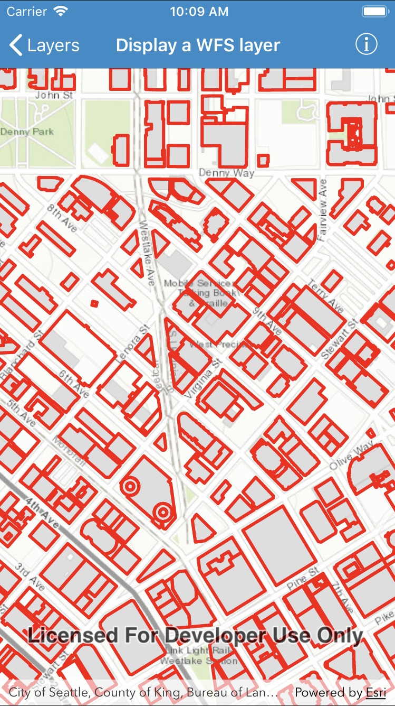

# Display a WFS layer

This sample demonstrates how to display a layer from a WFS service, requesting only features for the current extent.

WFS is an open standard with functionality similar to ArcGIS feature services. Runtime support for WFS allows you to interoperate with open systems, which are often used in inter-agency efforts, like those for disaster relief.

## How to use the sample

Pan and zoom to see features within the current map extent.

## How it works

1. Create an instance of `AGSWFSFeatureTable` with a URL. 
2. Set the feature request mode to `manualCache`.
3. Create an instance of `AGSFeatureLayer` from the feature table and add it to the map.
4. Whenever map's view point is changed, call `populateFromService(with:clearCache:outFields:completion:)` to load the table with data for the current visible extent.

## Relevant API

* `AGSFeatureLayer`
* `AGSWFSFeatureTable`
* `AGSWFSFeatureTable.populateFromService(with:clearCache:outFields:completion:)`
* `AGSGeoView.viewpointChangeHandler`

## About the data

This service shows building footprints for downtown Seattle. For additional information, see the underlying service [on ArcGIS Online](https://arcgisruntime.maps.arcgis.com/home/item.html?id=1b81d35c5b0942678140efc29bc25391).

## Tags

OGC, WFS, feature, web, service, layers, browse, catalog, interaction cache

