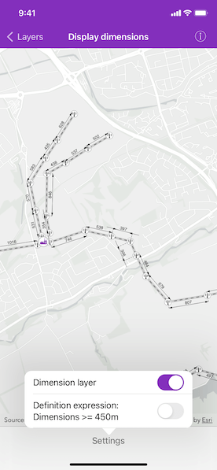

# Display dimensions

Display dimension features from a mobile map package.

## Use case

Dimensions show specific lengths or distances on a map. A dimension may indicate the length of a land parcel, or the distance between two features, such as a fire hydrant and the corner of a building.

## How to use the sample

When the sample loads, it will automatically display the map containing dimension features from the mobile map package. Control the visibility of the dimension layer, and apply a definition expression to show dimensions greater than or equal to 450m in length using the toggles.

**Note**: the minimum scale range of the sample is set to 1:40,000 to maintain readability of the dimension features.

## How it works

1. Create an `AGSMobileMapPackage` specifying the path to the .mmpk file.
2. Load the mobile map package (mmpk).
3. After the mmpk successfully loads, get the map from the mmpk and add it to the map view.
4. Loop through the map's layers to find the `AGSDimensionLayer`.
5. Control the dimension layer's visibility with `isVisible` property, and set a definition expression on its `definitionExpression` property.

## Relevant API

* AGSDimensionLayer
* AGSMobileMapPackage

## About the data

This sample shows a subset of the network of pylons, substations, and power lines around Edinburgh, Scotland within a [Edinburgh Pylon Dimensions mobile map package](https://arcgis.com/home/item.html?id=f5ff6f5556a945bca87ca513b8729a1e). The data was digitized from satellite imagery and is intended to be used for illustrative purposes only.

## Additional information

Dimension layers can be taken offline from a feature service hosted on ArcGIS Enterprise 10.9 or later, using the [`AGSGeodatabaseSyncTask`](https://developers.arcgis.com/ios/api-reference/interface_a_g_s_geodatabase_sync_task.html). Dimension layers are also supported in mobile map packages or mobile geodatabases created in ArcGIS Pro 2.9 or later.

## Tags

definition expression, dimension, distance, layer, length, mmpk, mobile map package, utility
