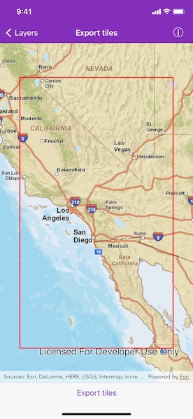

# Export tiles

Download tiles to a local tile cache file stored on the device.

## Use case

Field workers with limited network connectivity can use exported tiles as a basemap for use offline.

## How to use the sample

Pan and zoom into the desired area, making sure the area is within the red boundary. Click the 'Export tiles' button to start the process. On successful completion you will see a preview of the downloaded tile package.

## How it works

1. Create an `AGSExportTileCacheTask`, passing in the URL of the tiled layer.
2. Create default `AGSExportTileCacheParameters` for the task, specifying the area of interest, minimum scale and maximum scale.
3. Use the parameters and a path to create an `AGSExportTileCacheJob` from the task.
4. Start the job, and when it completes successfully, get the resulting `AGSTileCache`.
5. Use the tile cache to create an `AGSArcGISTiledLayer`, and display it in the map.

## Relevant API

* AGSArcGISTiledLayer
* AGSExportTileCacheJob
* AGSExportTileCacheParameters
* AGSExportTileCacheTask
* AGSTileCache

## Additional information

ArcGIS tiled layers do not support reprojection, query, select, identify, or editing. Visit the [ArcGiS Online Developer's portal](https://developers.arcgis.com/ios/latest/swift/guide/layer-types-described.htm#ESRI_SECTION1_30E7379BE7FE4EC2AF7D8FBFEA7BB4CC) to Learn more about the characteristics of ArcGIS tiled layers.

## Tags

cache, download, offline
