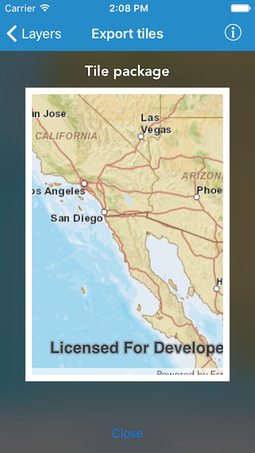

#Export tiles

This sample demonstrates how to export tiles from a map server

##How to use the sample

Pan and zoom into the desired area, making sure the area is within the red block. Tap on the `Export tiles` button to start the process. On successful completion you will see a preview of the downloaded tpk.

##How it works

The sample uses the `exportTileCacheParameters(withAreaOfInterest:minScale:maxScale:completion:)` method on `AGSExportTileCacheTask` class to generate `AGSExportTileCacheParameters` parameters by providing the area of interest and the min max scale for the tpk. It then uses these parameters in the `exportTileCacheJob(with:downloadFilePath:)` method to generate an `AGSJob`. The job on successful completion gives an `AGSTileCache` object which is used to create an `AGSArcGISTiledLayer` and shown in a map as preview.

