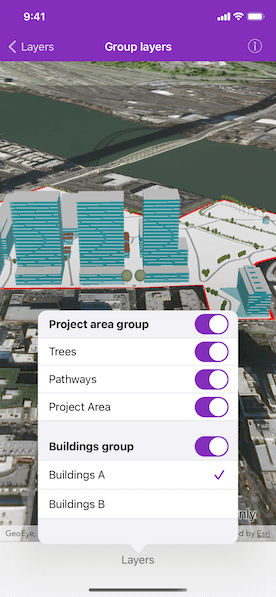

# Group layers

Group a collection of layers together and toggle their visibility as a group.

## Use case

Group layers communicate to the user that layers are related and can be managed together. In a land development project, you might group layers according to the phase of development.

## How to use the sample

The layers in the map will be displayed in a table of contents. Toggle the switch next to a layer's name or tap the cell to change its visibility. Turning a group layer's visibility off will override the visibility of its child layers.

## How it works

1. Create an `AGSGroupLayer` object.
2. Add a child layer to the group layer's layers collection.
3. Set the group layer's `groupVisibilityMode` to change its behavior:
    * `groupVisibilityMode.INDEPENDENT` allows each sublayer to change its visibility independently.
    * `groupVisibilityMode.EXCLUSIVE` allows only one sublayer to be visible at a time.
    * `groupVisibilityMode.INHERITED` treats the group layer as if it is one merged layer.
4. To toggle the visibility of the group, simply change the group layer's `isVisible` property.

## Relevant API

* AGSGroupLayer

## Additional information

The full extent of a group layer may change when child layers are added/removed. Group layers do not have a spatial reference, but the full extent will have the spatial reference of the first child layer.

Group layers can be saved to web scenes. In web maps, group layers will be flattened in the web map's operational layers.

## Tags

group layer, layers
