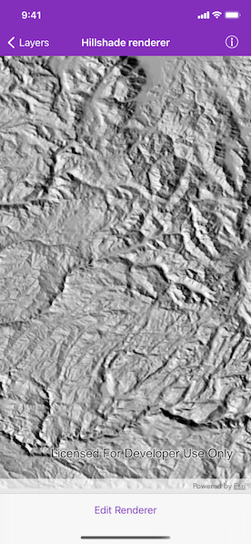
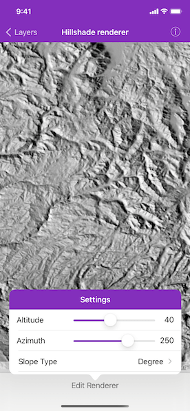

# Hillshade renderer

Apply a hillshade renderer to a raster.

## Use case

An environmental agency may track coastal erosion by comparing images of an area taken over a a longer period of time with hillshade renderers applied.

## How to use the sample

Choose and adjust the settings to update the hillshade renderer on the raster layer. The sample allows you to change the altitude, azimuth, and slope type.

## How it works

1. Create an `AGSRaster` from a grayscale raster file.
2. Create an `AGSRasterLayer` from the raster.
3. Create an `AGSBasemap` from the raster layer and set it to the map.
4. Create an `AGSHillshadeRenderer`, specifying the alititude and other properties.
5. Set raster layer's `AGSRenderer` to the previously created `AGSHillshadeRenderer`.

## Relevant API

* AGSBasemap
* AGSHillshadeRenderer
* AGSRaster
* AGSRasterLayer

## Tags

altitude, angle, azimuth, raster, slope, visualization
