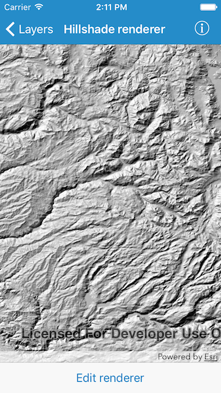
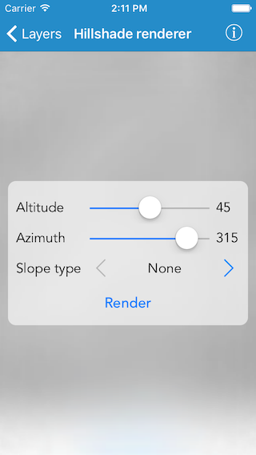

#Hillshade renderer

This sample demonstrates how to use hillshade renderer on a raster

##How to use the sample

Tap on the `Edit renderer` button in the toolbar to change the settings for the hillshade. The sample allows you to change the `Altitude`, `Azimuth` and `Slope type`. You can tap on the `Render` button to update the raster.

##How it works

The sample uses `AGSHillshadeRenderer` class to generate hillshade renderers. The settings provided by the user are put in the initializer `init(altitude:azimuth:zFactor:slopeType:pixelSizeFactor:pixelSizePower:outputBitDepth:)` to get a new renderer and the renderer is then set on the raster. 

