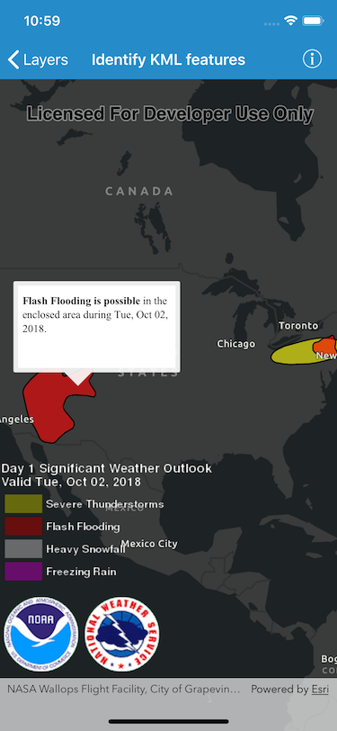

# Identify KML features

Show a balloon popup with formatted content for tapped KML features. KML supports defining HTML for popups.

## How to use the sample

Click or tap a feature to identify it. Feature information will be displayed in a callout. 

Note: the KML layer used in this sample contains a screen overlay. The screen overlay contains a legend and the logos for NOAA and the NWS. You can't identify the screen overlay.

## How it works

1. The identify process starts when the user taps the map. 
2. Any existing callout is dismissed using `AGSCallout.dismiss()`
3. `AGSGeoView.identifyLayer(_:screenPoint:tolerance:returnPopupsOnly:completion:)` is called with a reference to the KML layer, the tapped position, and a tolerance of `15` points.
4. There are several types of KML features. This sample will only identify features of type `AGSKMLPlacemark`
5. The `balloonContent` of the first returned KML placemark is then shown in a callout.

## Relevant API

* `AGSKMLLayer`
* `AGSKMLPlacemark`
* `AGSKMLPlacemark.balloonContent`
* `AGSIdentifyLayerResult`
* `AGSGeoView.identifyLayer(_:screenPoint:tolerance:returnPopupsOnly:completion:)`

## About the data

This sample shows a forecast for significant weather within the U.S. Regions of severe thunderstorms, flooding, snowfall, and freezing rain are shown. Tap the features to see details.

## Tags

Weather, NOAA, NWS, KML, KMZ, OGC, Keyhole