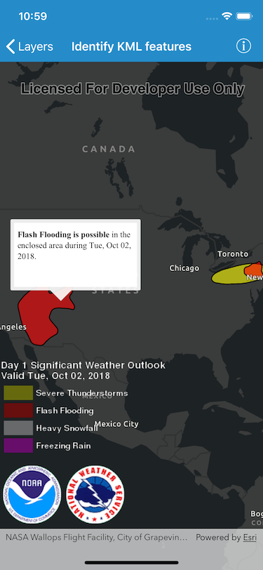

# Identify KML features

Show a balloon popup with formatted content for tapped KML features. KML
supports defining HTML for popups.

## How to use the sample

Click or tap a feature to identify it. Feature information will be
displayed in a callout.

Note: the KML layer used in this sample contains a screen overlay. The
screen overlay contains a legend and the logos for NOAA and the NWS. You
can’t identify the screen overlay.

## How it works

1.  The identify process starts when the user taps the map.
2.  Any existing callout is dismissed using `AGSCallout.dismiss()`
3.  `AGSGeoView.identifyLayer(_:screenPoint:tolerance:returnPopupsOnly:completion:)`
    is called with a reference to the KML layer, the tapped position,
    and a tolerance of `15` points.
4.  There are several types of KML features. This sample will only
    identify features of type `AGSKMLPlacemark`
5.  The `balloonContent` of the first returned KML placemark is then
    shown in a callout.

## About the data

This sample shows a forecast for significant weather within the U.S.
Regions of severe thunderstorms, flooding, snowfall, and freezing rain
are shown. Tap the features to see details.
