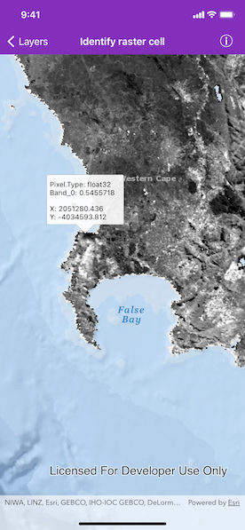

# Identify raster cell

Get the cell value of a local raster at the tapped location and display the result in a callout.

## Use case

You may want to identify a raster layer to get its exact cell value in case the approximate value conveyed by its symbology is not sufficient. The information available for the raster cell depends on the type of raster layer being identified. For example, a 3-band satellite or aerial image might provide 8-bit RGB values, whereas a digital elevation model (DEM) would provide floating point z values. By identifying a raster cell of a DEM, you can retrieve the precise elevation of a location.

## How to use the sample

Tap or long press drag on an area of the raster to identify it and see the raster cell attributes information displayed in a callout.

## How it works

1. Use various delegate methods in `AGSGeoViewTouchDelegate` to get the screenPoint where a user tapped or long pressed on the map.
2. On tap or long press drag:
   * Dismiss the `AGSCallout`, if one is showing.
   * Call `AGSGeoView.identifyLayer(_:screenPoint:tolerance:returnPopupsOnly:completion:)` passing in the raster layer, screen point, tolerance, and if only layers containing popups should be returned.
   * Get the `AGSGeoElement`s from the layer identifying result.
   * Create a callout and populate the callout content with text from the `AGSRasterCell` attributes and coordinates.
   * Show the callout.

## Relevant API

* AGSGeoView.identifyLayer(_:screenPoint:tolerance:returnPopupsOnly:completion:)
* AGSIdentifyLayerResult
* AGSRasterCell
* AGSRasterCell.attributes
* AGSRasterLayer

## About the data

The data shown is an NDVI classification derived from MODIS imagery between 27 Apr 2020 and 4 May 2020. It comes from the [NASA Worldview application](https://worldview.earthdata.nasa.gov/). In a normalized difference vegetation index, or [NDVI](https://en.wikipedia.org/wiki/Normalized_difference_vegetation_index), values range between -1 and +1 with the positive end of the spectrum showing green vegetation.

## Tags

band, cell, cell value, continuous, discrete, identify, pixel, pixel value, raster
