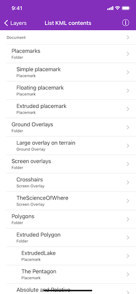

# List KML contents

List the contents of a KML file.

## Use case

KML files can contain a hierarchy of features, including network links to other KML content. A user may wish to traverse through the contents of KML nodes to know what data is contained within each node and, recursively, their children.

## How to use the sample

The contents of the KML file are shown in a tree. Select a node to zoom to that node. Not all nodes can be zoomed to (e.g. screen overlays).

## How it works

1. Apply an `AGSKMLDataset` to the `AGSSceneView`'s `kmlDatasaet`.
2. Explore the root nodes of the `AGSKMLDataset` recursively explored to create a view model.
  * Each node is enabled for display at this step. KML files may include nodes that are turned off by default.
3. When a node is selected, use the node's `extent` to determine a `AGSViewpoint` and set it to the `AGSSceneView`.

## Relevant API

* AGSKMLContainer
* AGSKMLDataset
* AGSKMLDocument
* AGSKMLFolder
* AGSKMLGroundOverlay
* AGSKMLLayer
* AGSKMLNetworkLink
* AGSKMLNode
* AGSKMLPlacemark
* AGSKMLScreenOverlay

## Tags

Keyhole, KML, KMZ, layers, OGC
