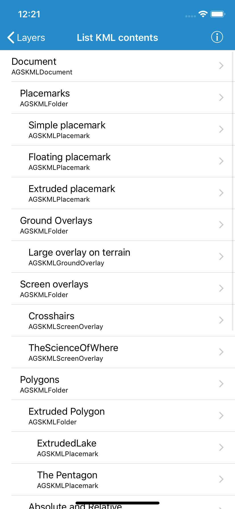

# List KML contents

List the contents of a KML file. KML files can contain a hierarchy of features, including network links to other KML content.

## How to use the sample

All nodes of the KML file are shown in the table view, with the hierarchy indicated by indentation. Tap a node to see its extent in a scene view. Not all nodes have an extent (e.g. screen overlays).

## How it works

1. A local KML file is loaded as an `AGSKMLDataset` to be used throughout the sample.
2. All KML nodes are recursively set to be visible—since some may not be visible by default—and loaded into a array to use as the table's data source, starting with the `rootNodes` property.
3. When a cell is tapped, the entire KML dataset is shown as a `AGSKMLLayer` in a `AGSSceneView`. A viewpoint for the node is created, if possible, and set with the `setViewpoint` function of `AGSSceneView`.

## Relevant API

* `AGSKMLDataset`
* `AGSKMLNode`
* `AGSKMLLayer`

## About the data

This is an example KML file meant to demonstrate how Runtime supports several common features.

## Tags

KML, KMZ, OGC, Keyhole