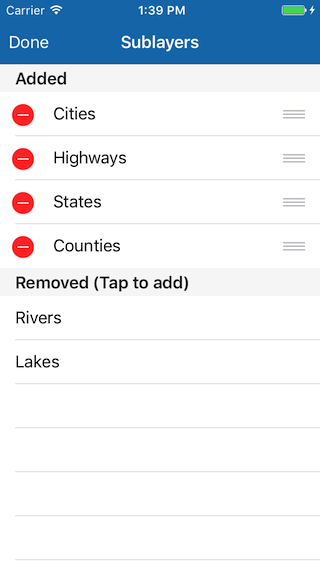
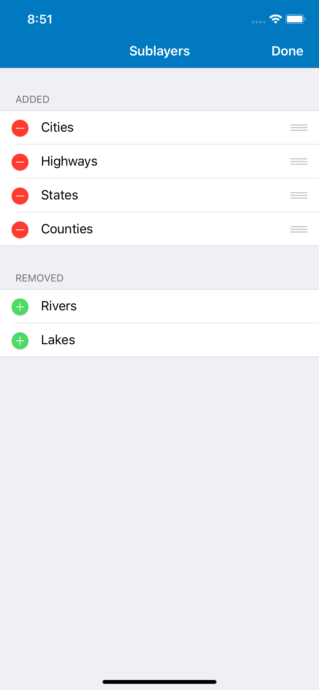

# Manage sublayers

This sample demonstrates how to add table sublayer source as map image sublayers; how to remove a sublayer and rearrange existing sublayers in a map image layer.

## How to use the sample

Tap on the `Manage Sublayers` button in the bottom toolbar to get a list of sublayers present in the map image layer and also a list of sublayers you can add to it. You can tap on one of the removed sublayers to add it to the map image layer. You can tap on the button on the left to delete a sublayer and hold and move a cell to reorder the sublayers.

## How it works

To add a table sublayer source with known workspaceID and data source name, the sample uses the `init(workspaceID:dataSourceName:)` initializer and creates an `AGSTableSublayerSource` object. An `AGSArcGISMapImageSublayer` is created from this tableSublayerSource using the initializer `init(id:source:)`. The sublayer is then added to the `mapImageSublayers` array on mapImageLayer.

Similarly, to remove a sublayer, it is removed from the `mapImageSublayers` array. And to reorder, the sublayer is removed from current index and added at the new index.

