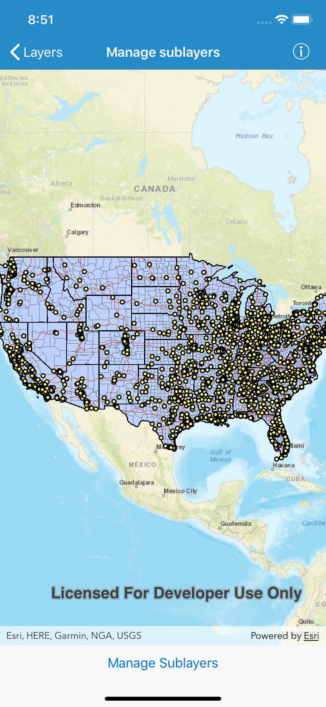

# Manage sublayers

Add, remove, or rearrange existing sublayers in a map image layer.

# Use case

A map image layer may contain many sublayers such as different types of roads in a road network or city, county, and state borders in a US map. The user may only be interested in a subset of these sublayers. Or, perhaps showing all of the sublayers would show too much detail. In these cases, you can add, remove, or rearrange the order of the sublayers.

## How to use the sample

Tap the bottom button to display a list of sublayers. Tap the red button to remove a layer. Tap the green button to add a layer. Tap and drag the the right of a cell to rearrange the order of the layers.

## How it works

1.  Create an `AGSArcGISMapImageLayer` object with the URL to a map image service.
2.  Get all of the map image layer's `AGSArcGISMapImageSublayer`s.
3.  For each corresponding layer, add to, remove from, or rearrange the array of sublayers.

## Relevant API

* AGSArcGISMapImageLayer
* AGSArcGISMapImageSublayer

## Tags

layer, sublayer, visibility
