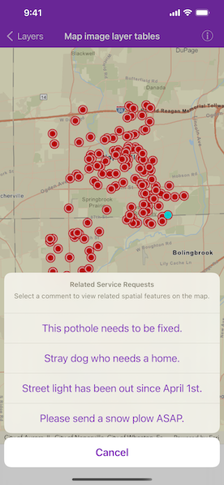

# Map image layer tables

Find features in a spatial table related to features in a non-spatial table.

## Use case

The non-spatial tables contained by a map service may contain additional information about sublayer features. Such information can be accessed by traversing table relationships defined in the service.

## How to use the sample

Tap the toolbar button to prompt a list of comment data from non-spatial features. Tap on one of the comments to query related spatial features and display the first result on the map.

## How it works

1. Create an `AGSArcGISMapImageLayer` with the URL of a map image service.
2. Load the tables and layers using `loadTablesAndLayers(completion:)` and get one its first table.
3. To query the table, create`AGSQueryParameters`. Set its `whereClause` to filter the request features.
4. Use `queryFeatures(with:queryFeatureFields:completion:)` to get the `AGSFeatureQueryResult`.
5. Make `AGSFeatureQueryResult` iterable using `featureEnumerator()`and loop through to get each `AGSFeature`.
6. To query for related features, get the table's relationship info with `AGSServiceFeatureTable.layerInfo.relationshipInfos`. This returns an array of `AGSRelationshipInfo`s. 
7. Now create `AGSRelatedQueryParameters` passing in the `AGSRelationshipInfo`. To query related features, use `AGSServiceFeatureTable.queryRelatedFeatures(for:parameters:completion:)`.
8. This returns an array of `AGSRelatedFeatureQueryResult`s, each containing a set of related features.

## Relevant API

* AGSArcGISFeature
* AGSArcGISMapImageLayer
* AGSFeature
* AGSFeatureQueryResult
* AGSQueryParameters
* AGSRelatedFeatureQueryResult
* AGSRelatedQueryParameters
* AGSRelationshipInfo
* AGSServiceFeatureTable

## Tags

features, query, related features, search
