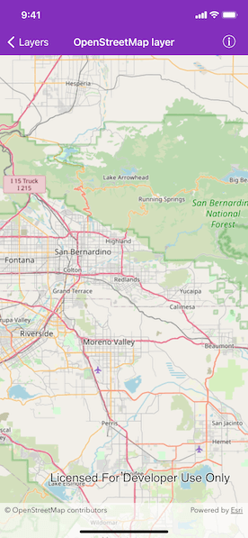

# OpenStreetMap Layer

Add OpenStreetMap as a basemap layer.

## Use case

You may want to create a map with an [OpenStreetMap](https://www.openstreetmap.org); which is a free community-edited basemap.

## How to use the sample

When the sample opens, it will automatically display the map with the OpenStreetMap basemap. Pan and zoom to observe the basemap.

## How it works

1. Create an `AGSMap` with `openStreetMap` as the `basemapType` and specify the other properties.
2. Apply the `AGSMap` to the `AGSMapView`.

## Relevant API

* AGSBasemap
* AGSMap
* AGSMapView
* AGSOpenStreetMapLayer

## Additional information

The attribution text will be set to the required OpenStreetMap attribution automatically. 

Apps that expect to make many requests to OpenStreetMap should consider using an alternative tile server via the `WebTiledLayer` class. See [layer types described](https://developers.arcgis.com/ios/latest/swift/guide/layer-types-described.htm#ESRI_SECTION1_B995CCAB20584F91890B3614CF16CF43) in the *ArcGIS Runtime SDK for iOS* documentation for more information on OpenStreetMap usage restrictions and alternatives.

Esri now hosts an [OpenStreetMap vector layer on ArcGIS Online](http://www.arcgis.com/home/item.html?id=3e1a00aeae81496587988075fe529f71) that uses recent OpenStreetMap data in conjunction with a style matching the default OpenStreetMap style. This layer is not subject to the tile access restrictions that apply to tiles fetched from OpenStreetMap.org.

## Tags

basemap, layers, map, open, OpenStreetMap, OSM, street
