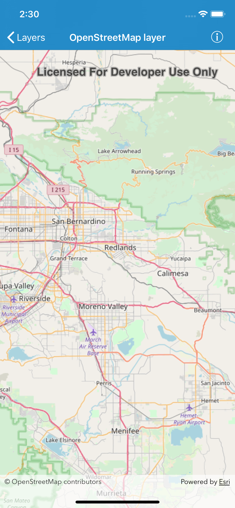

# OpenStreetMap Layer
This samples demonstrates how to display a map with an OpenStreetMap basemap.

## How it works
A `AGSMap` is instantiated with `AGSBasemapType.openStreetMap` passed in as the `basemapType` parameter. It is then set as the `map` of `AGSMapView`. The attribution required by OpenStreetMap is automatically added to the `attributionText ` of `AGSMapView` without any additional code.

## Relevant API
* `AGSMap`
* `AGSBasemapType`
* `AGSMapView`

#### Tags
Basemaps, Layers

