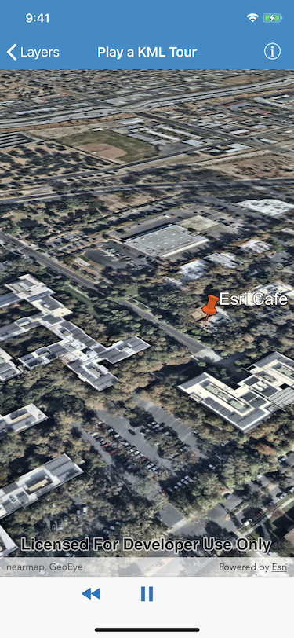

# Play a KML Tour

Play tours in KML files.

## Use case

KML, the file format used by Google Earth, supports creating tours, which can control the viewpoint of the scene, hide and show content, and play audio. Tours allow you to easily share tours of geographic locations, which can be augmented with rich multimedia. Runtime allows you to consume these tours using a simple API.

## How to use the sample

The sample will load the KMZ file from ArcGIS Online. When a tour is found, the Play button will be enabled. Use the Play and Pause buttons to control the tour. When you're ready to show the tour, use the reset button to return the tour to the unplayed state.

## How it works

1. Load the KML dataset and add it to a layer.
2. Create the KML tour controller. Wire up the buttons to the `play()`, `pause()`, and `rewind()` methods.
3. Explore the tree of KML content and find a KML tour. Once a tour is found, provide it to the KML tour controller.
4. Enable the buttons to allow the user to play, pause, and reset the tour.

## Relevant API

- `AGSKMLTourController`
- `AGSKMLTourController.tour`
- `AGSKMLTourController.play()`
- `AGSKMLTourController.pause()`
- `AGSKMLTourController.reset()`
- `AGSKMLTour`
- `AGSKMLTour.tourStatus`

## Offline data

Data will be downloaded from ArcGIS Online by the sample viewer automatically.

* [Esri_tour.kmz](https://arcgisruntime.maps.arcgis.com/home/item.html?id=f10b1d37fdd645c9bc9b189fb546307c)

## About the data

This sample uses a custom tour created by a member of the ArcGIS Runtime SDK samples team. When you play the tour, you'll see a narrated journey through some of Esri's offices.

## Additional information

See [Google's documentation](https://developers.google.com/kml/documentation/touring) for information about authoring KML tours.

## Tags

KML, tour, story, interactive, narration, play, pause, animation