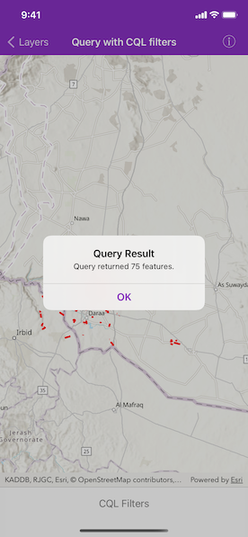
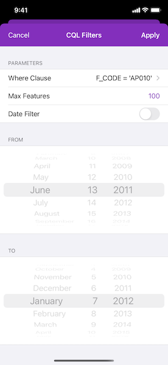

# Query with CQL filters

Query data from an OGC API feature service using CQL filters.

## Use case

CQL (Common Query Language) is an OGC-created query language used to query for subsets of features. Use CQL filters to narrow geometry results from an OGC feature table.

## How to use the sample

Configure a CQL query by setting a where clause, the max features count and a time extent. Press the "Apply" button to see the query applied to the OGC API features shown on the map.

## How it works

1. Create an `AGSOGCFeatureCollectionTable` object using a URL to an OGC API feature service and a collection ID.
2. Create a `AGSQueryParameters` object.
3. In the settings page, set the `whereClause` and the `maxFeatures` properties. Create `Date` objects for the start time and end time being queried and set the `timeExtent` property.
4. Populate the `AGSOGCFeatureCollectionTable` using `AGSOGCFeatureCollectionTable.populateFromService(with:clearCache:outfields:completion:)` with the custom query parameters created in the previous steps.
5. Set the view point with the feature table's extent to view the newly-queried features.

## Relevant API

* AGSOGCFeatureCollectionTable
* AGSQueryParameters
* AGSTimeExtent

## About the data

The [Daraa, Syria test data](https://demo.ldproxy.net/daraa) is OpenStreetMap data converted to the Topographic Data Store schema of NGA.

## Additional information

See the [OGC API website](https://ogcapi.ogc.org/) for more information on the OGC API family of standards. See the [CQL documentation](https://portal.ogc.org/files/96288#cql-core) to learn more about the common query language.

## Tags

browse, catalog, common query language, CQL, feature table, filter, OGC, OGC API, query, service, web
