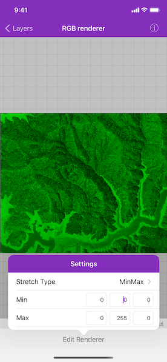
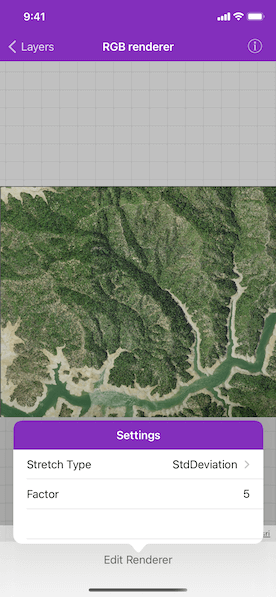

# RGB renderer

Apply an RGB renderer to a raster layer to enhance feature visibility.

## How to use the sample

Tap on the `Edit renderer` button in the toolbar to change the settings for the rgb renderer. The sample allows you to change the stretch type and the parameters for each type. You can tap on the Render button to update the raster.

## Use case

An RGB renderer is used to adjust the color bands of a multispectral image. Remote sensing images acquired from satellites often contain values representing the reflection of multiple spectrums of light. Changing the RGB renderer of such rasters can be used to differentiate and highlight particular features that reflect light differently, such as different vegetation types, or turbidity in water.

## How to use the sample

Tap the toolbar button to change the settings for the rgb renderer. You can change the stretch type and the parameters for each type.

## How it works

1. Create an `AGSRaster` from a from a local raster file.
2. Create an `AGSRasterLayer` from the raster.
3. Create an `AGSBasemap` from the raster layer and set it to the map.
4. Create an `AGSRGBRenderer`, specifying the `stretchParameters` and other properties.
5. Set the raster layer's `renderer` to the  `AGSRGBRenderer`.

## Relevant API

* AGSBasemap
* AGSRaster
* AGSRasterLayer
* AGSRGBRenderer
* AGSStretchParameters

## About the data

The raster used in this sample shows an area in the south of the Shasta-Trinity National Forest, California.

## Tags

analysis, color, composite, imagery, multiband, multispectral, pan-sharpen, photograph, raster, spectrum, stretch, visualization
