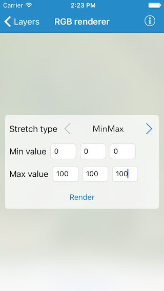

#RGB renderer

This sample demonstrates how to use rgb renderer on a raster layer.

##How to use the sample

Tap on the `Edit renderer` button in the toolbar to change the settings for the rgb renderer. The sample allows you to change the stretch type and the parameters for each type. You can tap on the Render button to update the raster.

##How it works

The sample uses `AGSRGBRenderer` class to generate rgb renderers. The settings provided by the user are put in the initializer `init(stretchParameters:bandIndexes:gammas:estimateStatistics:)` to get a new renderer and the renderer is then set on the raster.

