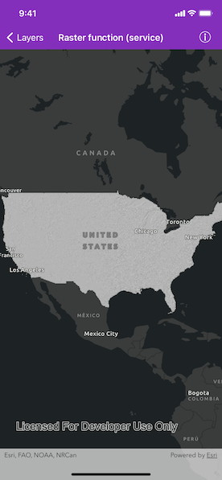

# Raster function (service)

Load a raster from a service, then apply a function to it.

## Use case

Raster functions allow processing operations that can be applied to one or more rasters on the fly. Functions can be applied to rasters that come from a service. A land survey agency may apply hillshade and aspect functions to rasters with elevation data in order to better determine the topography of a landscape and to make further planning decisions.

## How to use the sample

The raster function is applied automatically when the sample starts and the result is displayed.

## How it works

1. Create an `AGSImageServiceRaster` with the image server URL.
2. Create an `AGSRasterFunction` from a JSON string.
3. Get the name of the first raster name from the raster function's `rasterNames` array.
4. Set the raster argument with `AGSRasterFunctionArguments.setRaster(_:withName:)`.
5. Create a new `AGSRaster` referring to the raster function.
6. Create an `AGSRasterLayer` to visualize the computed raster.
7. Display the raster.

## Relevant API

* AGSImageServiceRaster
* AGSRaster
* AGSRasterFunction
* AGSRasterFunctionArguments
* AGSRasterLayer

## About the data

The sample applies a hillshade function to a raster produced from the National Land Cover Database, [NLCDLandCover2001](https://sampleserver6.arcgisonline.com/arcgis/rest/services/NLCDLandCover2001/ImageServer). You can learn more about the [hillshade function](https://desktop.arcgis.com/en/arcmap/latest/manage-data/raster-and-images/hillshade-function.htm) in the *ArcMap* documentation.

## Additional information

The raster function computation happens locally on the client device.

## Tags

function, layer, raster, raster function, service
