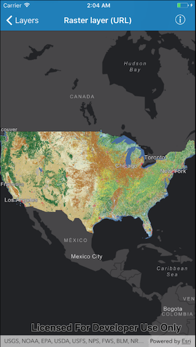

# Raster layer (URL)

This sample demonstrates how to create and use a raster layer from a URL.

## How it works

Create an instance of `AGSImageServiceRaster` from a URL using the initializer `init(url:)`. Then create a raster layer with the initializer `init(raster:)` that is provided on `AGSRasterLayer` class . Finally, add this raster layer to the operational layers of the map.

