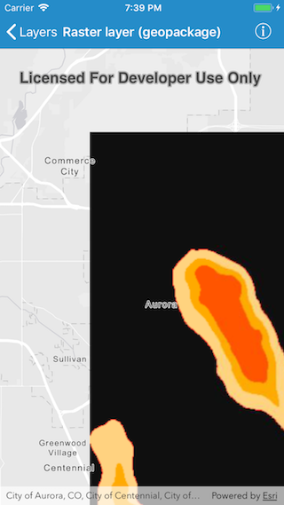

# Raster layer (geopackage)

This sample demonstrates how to show a raster layer on a map using a geopackage.

## How it works

The sample creates an instance of `AGSGeoPackage` using the initializer `init(name:)` where the name refers to a geopackage file that has been included in the application bundle. The geopackage is loaded and, upon completion, the first raster is used to create a raster layer that is added to the list of operational layers of the map.
