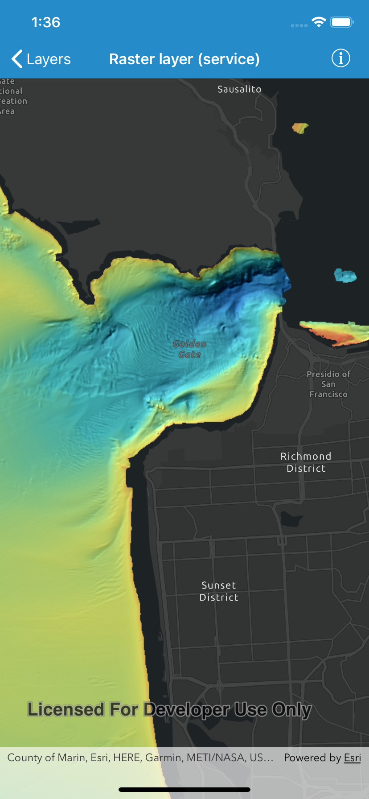

# Raster layer (service)

This sample demonstrates how to create and use a raster layer from an ArcGIS Image service.

## How it works

Create an instance of `AGSImageServiceRaster` from a URL to an ArcGIS Image Service using the initializer `init(url:)`. Then create an instance of  `AGSRasterLayer` with the initializer `init(raster:)`. Finally, add this raster layer to the operational layers of the map.

