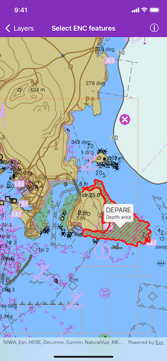

# Select ENC features

Select features in an ENC layer.

## Use case

You can use selection to identify a feature and learn more about it. ENC layers often have many overlapping features and features of mixed geometry in a single layer, so the sample includes code for identifying the most relevant feature.

## How to use the sample

Tap to select ENC features. Feature acronym and description will be displayed in a callout.

## How it works

1. Load and display the ENC layers.
2. Identify the layers tapped on the map view with `AGSGeoView.identifyLayers(atScreenPoint:tolerance:returnPopupsOnly:completion:)`.
3. Filter the list of identified layers to include only results where the `layerContent` is an `AGSENCLayer`.
4. Get the first result.
5. Get the first feature in the result.
6. Select that feature by calling `AGSENCLayer.select(_:)`.
7. Show the feature's acronym and description in a callout.

## Relevant API

* AGSENCFeature
* AGSENCLayer
* AGSIdentifyLayerResult

## Offline data

This sample downloads the [ENC Exchange Set without updates](https://www.arcgis.com/home/item.html?id=9d2987a825c646468b3ce7512fb76e2d) item from *ArcGIS Online*.

The latest [hydrography package](https://developers.arcgis.com/downloads/data) can be downloaded from *ArcGIS Developer* website (login is required). The *S57DataDictionary.xml* file is contained in it along with many others but a user does not need to know that in order to render ENC data.

## Additional information

Read more about [Electronic Navigational Charts](https://developers.arcgis.com/ios/layers/display-electronic-navigational-charts/) and its [deployment](https://developers.arcgis.com/ios/license-and-deployment/deployment/#enc-electronic-navigational-charts-style-directory) on the *ArcGIS Developer* website.

## Tags

chart, hydrography, identify, IHO, maritime, S-57, S57, select, selection
