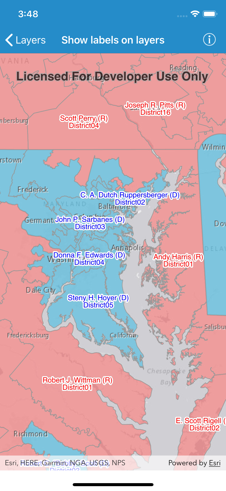

# Show labels on layers

This sample demonstrates how to show labels on feature layers.

## How to use the sample

Open the sample and wait for the layer to load. Scale and pan the map to view the labels.

## How it works

1. An `AGSServiceFeatureTable` object is created using a URL to an online feature service.
2. An `AGSFeatureLayer` object is created from the feature table.
3. For each group of features we want to label:

    1. An `AGSTextSymbol` object is created and configured with the desired color and style.
    2. A SQL WHERE statement `String` is created specifying what features should be labeled with this style.
    3. An expression `String` is created specifying the content of the label using the table's attributes.
    4. A dictionary representing the label as a JSON object is created from the text symbol, WHERE statement, and expression.
    5. An `AGSLabelDefinition` object is created from the JSON object.
    6. The label definition is added to the `labelDefinitions` array of the `AGSFeatureLayer`.
  
4. Labels are enabled for the layer by setting `labelsEnabled` to `true` on the `AGSFeatureLayer` object.

##Relevant API

- `AGSFeatureLayer`
    - `labelDefinitions`
    - `labelsEnabled`
- `AGSLabelDefinition`
    - `fromJSON(_:)`
- `AGSTextSymbol`
    - `toJSON()`