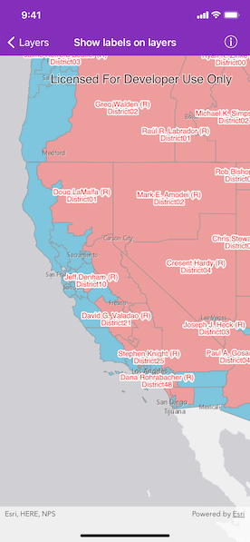

# Show labels on layers

Display custom labels on a feature layer.

## Use case

Labeling features is useful to visually display a key piece of information or attribute of a feature on a map. For example, you may want to label rivers or street with their names. 

## How to use the sample

Pan and zoom around the United States. Labels for congressional districts will be shown in red for Republican districts and blue for Democrat districts. Notice how labels pop into view as you zoom in.

## How it works

1. Create an `AGSServiceFeatureTable` using a feature service URL.
2. Create an `AGSFeatureLayer` from the service feature table.
3. Create an `AGSTextSymbol` to use for displaying the label text.
4. Create a JSON string for the label definition.
    * Set the "LabelExpressionInfo.expression" key to express what the text the label should display. You can use fields of the feature by using `$feature.NAME` in the expression.
    * To use the text symbol, set the "symbol" key to the symbol's JSON representation using `AGSTextSymbol.toJSON()`.
5. Create a label definition from the JSON using `class AGSJSONSerializable.fromJSON(_:)`.
6. Add the definition to the feature layer's `labelDefinitions` array.
7. Lastly, enable labels on the layer by setting its `labelsEnabled` property to `true`.

## Relevant API

* AGSFeatureLayer
* AGSLabelDefinition
* AGSTextSymbol

## About the data

This sample uses the [USA 116th Congressional Districts](https://www.arcgis.com/home/item.html?id=cc6a869374434bee9fefad45e291b779) feature layer hosted on ArcGIS Online.

## Additional information

Help regarding the JSON syntax for defining a label definition can be found in [labeling info](https://developers.arcgis.com/web-map-specification/objects/labelingInfo/) in the *Web map specification*.

## Tags

attribute, deconfliction, label, labeling, string, symbol, text, visualization
