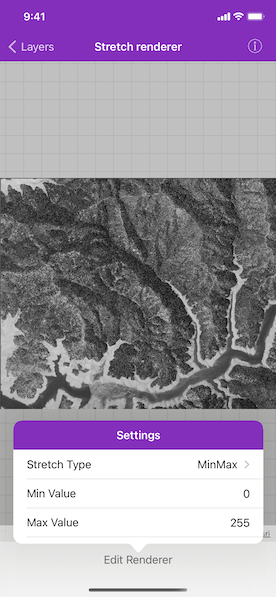
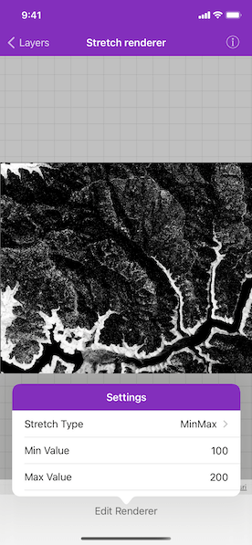

# Stretch renderer

Use a stretch renderer to enhance the visual contrast of raster data for analysis.

## Use case

An appropriate stretch renderer can enhance the contrast of raster imagery, allowing the user to control how their data is displayed for efficient imagery analysis.

## How to use the sample

Tap the toolbar button to change any of the following properties:

* Stretch type - a histogram stretch that will be applied to the raster to enhance its appearance.
* Min value - the minimum value on the histogram.
* Max value - the maximum value on the histogram.

## How it works

1. Create an `AGSRaster` from a raster file.
2. Create an `AGSRasterLayer` from the `AGSRaster`.
3. Add the layer to the map.
4. Create an `AGSStretchRenderer`, specifying the `AGSStretchParameters` and other properties.
5. Apply the `AGSStretchRenderer` to the raster layer.

## Relevant API

* AGSColorRamp
* AGSMinMaxStretchParameters
* AGSPercentClipStretchParameters
* AGSRaster
* AGSRasterLayer
* AGSStandardDeviationStretchParameters
* AGSStretchParameters
* AGSStretchRenderer

## Offline data

This sample uses a [raster file](https://arcgisruntime.maps.arcgis.com/home/item.html?id=95392f99970d4a71bd25951beb34a508). It is downloaded from ArcGIS Online automatically.

## About the data

The raster used in this sample shows an area in the south of the Shasta-Trinity National Forest, California.

## Additional information

See [Stretch function](https://desktop.arcgis.com/en/arcmap/latest/manage-data/raster-and-images/stretch-function.htm) in the *ArcMap* documentation for more information about the types of stretches that can be performed.

## Tags

analysis, deviation, histogram, imagery, interpretation, min-max, percent clip, pixel, raster, stretch, symbology, visualization
