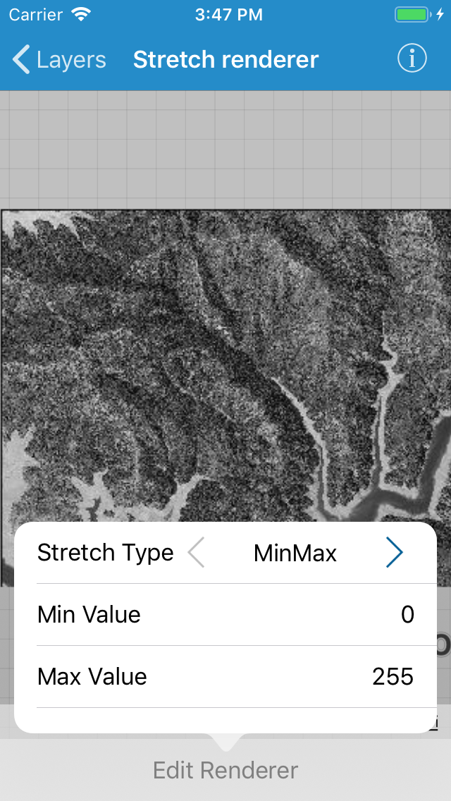
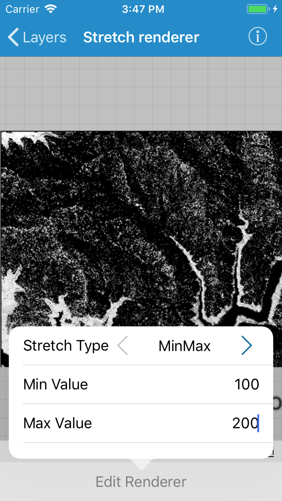

# Stretch renderer

This sample demonstrates how to use stretch renderer on a raster layer.

## How to use the sample

Tap the `Edit Renderer` button in the toolbar to open the settings for the stretch renderer. As you change the stretch type, the min, and the max, the raster layer will update accordingly.

## How it works

The sample uses `AGSStretchRenderer` class to generate stretch renderers. The settings provided by the user are put in the initializer `init(stretchParameters:gammas:estimateStatistics:colorRamp:)` to get a new renderer and the renderer is then set on the raster.

