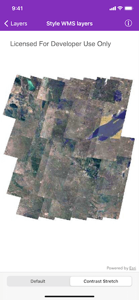

# Style WMS layers

Change the style of a Web Map Service (WMS) layer.

## Use case

Layers hosted on WMS may have different pre-set styles available to apply to them. Swapping between these styles can help during visual examination of the data. For example, increasing the contrast of satellite images can help in identifying urban and agricultural areas within forested areas.

## How to use the sample

Once the layer loads, tap the bottom two buttons to select a type of style.

## How it works

1. Create an `AGSWMSLayer` specifying the URL of the service and the layer names you want.
2. When the layer is done loading, get its array of `AGSWMSSublayer`s.
3. Change the current style of the `AGSWMSSublayer` to one of the styles from its `styles` array.

## Relevant API

* AGSWMSLayer
* AGSWMSSublayer
* AGSWMSSublayerInfo

## About the data

This sample uses a public service managed by the State of Minnesota and provides composite imagery for the state and the surrounding areas.

## Tags

imagery, styles, visualization, WMS
